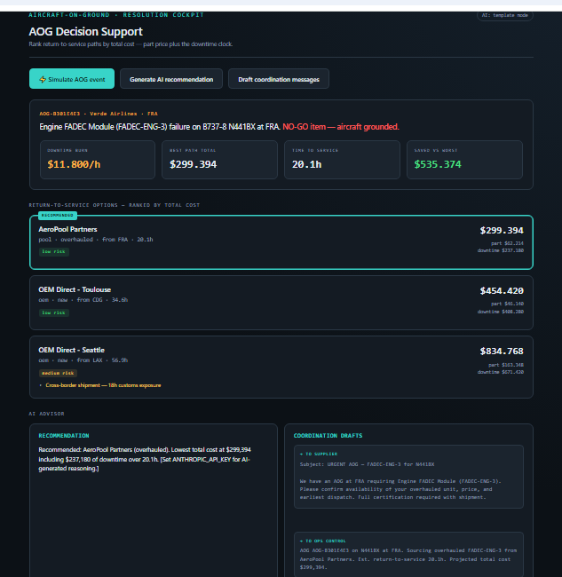

# ✈️ AOG Resolution Cockpit

**Decision-support tool that picks the cheapest way to get a grounded aircraft flying again — by pricing the one cost everyone forgets: the waiting.**

When an aircraft is grounded (an "Aircraft-on-Ground" or **AOG** event), every hour it sits idle costs the airline $10,000–$23,000. The person sourcing the replacement part faces several options and the instinct is to grab the cheapest part. **That instinct is often wrong** — a cheap used part stuck in customs with missing paperwork can ground the plane for days, costing far more in lost flying time than an expensive part that arrives ready to install.

This tool makes that invisible cost visible. It ranks every sourcing option by **total cost = part price + (hours grounded × cost per hour)**, flags the hidden risks (customs delays, missing certification), and uses AI to explain the recommendation and draft the urgent coordination emails.



---

## Why this is interesting

- **It models a real, expensive problem.** AOG groundings cost the aviation industry ~$11B/year, and the gap between a fast and slow resolution is usually paperwork and logistics — not the technical fix.
- **It surfaces a counterintuitive insight.** The cheapest part is frequently the most expensive *outcome*. The tool catches the trap a human under pressure would miss.
- **It's built to become real.** All synthetic data is isolated in one file (`datagen.py`). Swapping in a real airline's data feed means replacing that one file — the engine, AI layer, and UI never change.
- **It degrades gracefully.** The AI features fall back to clean templates if no API key is present, so the app always runs.

## How it works

| File | Role |
|------|------|
| `app/models.py` | Defines the core data shapes (the project's vocabulary) |
| `app/datagen.py` | Generates realistic synthetic AOG events *(the swap-to-real seam)* |
| `app/engine.py` | Ranks options by true total cost; flags risks *(the core logic)* |
| `app/ai.py` | Uses Claude to explain recommendations & draft messages |
| `app/main.py` | FastAPI web server connecting logic to the browser |
| `static/index.html` | The dashboard UI |

## Run it locally

```bash
# 1. Install the two dependencies
pip install fastapi uvicorn

# 2. Start the server
uvicorn app.main:app --reload

# 3. Open http://localhost:8000 in your browser
```

Click **Simulate AOG event** to generate a scenario and see the options ranked by what they truly cost.

### Optional: enable live AI

The app runs fully without AI (using templates). To enable live AI-generated reasoning and message drafting, set an Anthropic API key before starting:

```bash
# Windows
set ANTHROPIC_API_KEY=your-key-here
# Mac/Linux
export ANTHROPIC_API_KEY=your-key-here
```

## Tech stack

Python · FastAPI · vanilla HTML/CSS/JS · Anthropic API

aog-cockpit/
├── app/
│   ├── models.py
│   ├── datagen.py
│   ├── engine.py
│   ├── ai.py
│   └── main.py
├── static/
│   └── index.html
└── README.md
